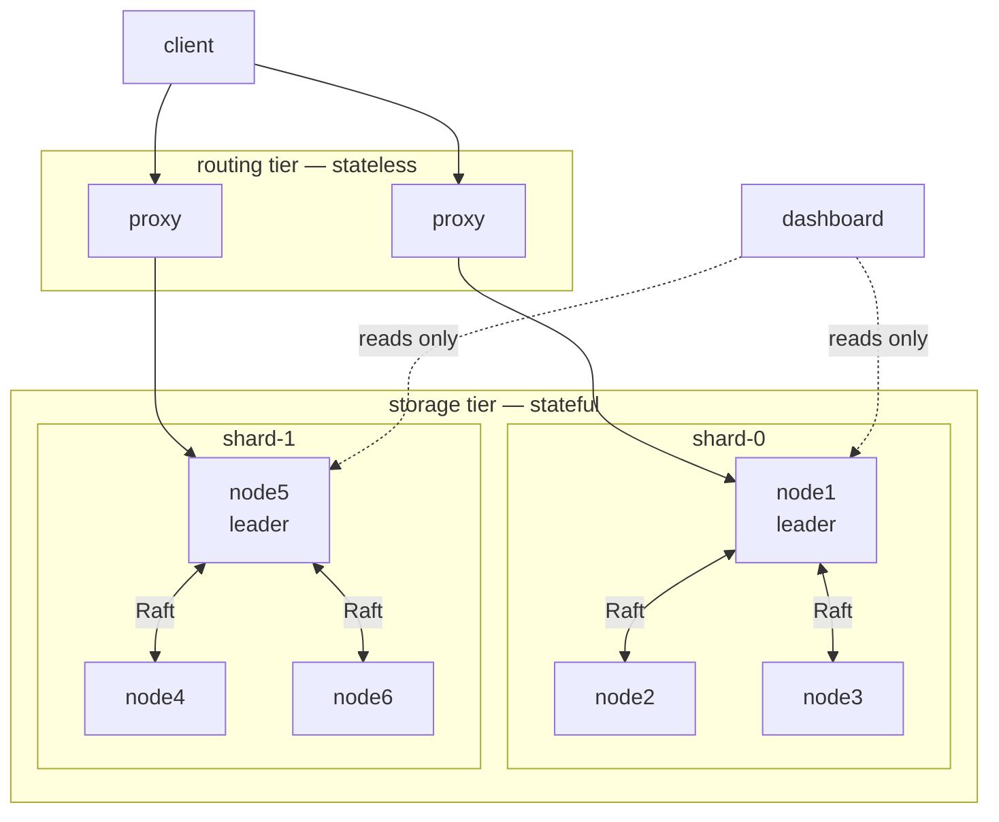
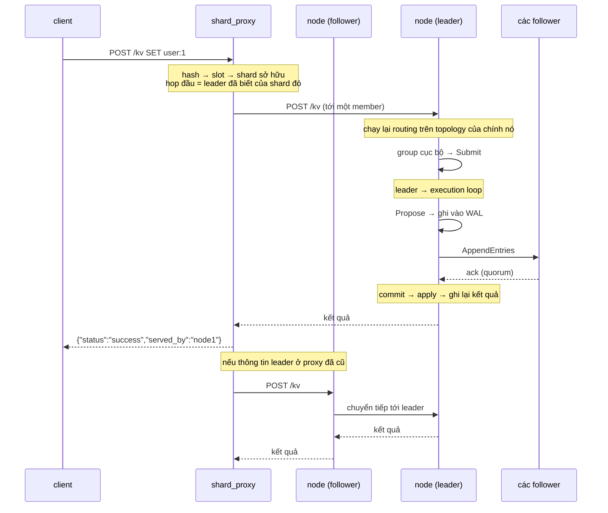
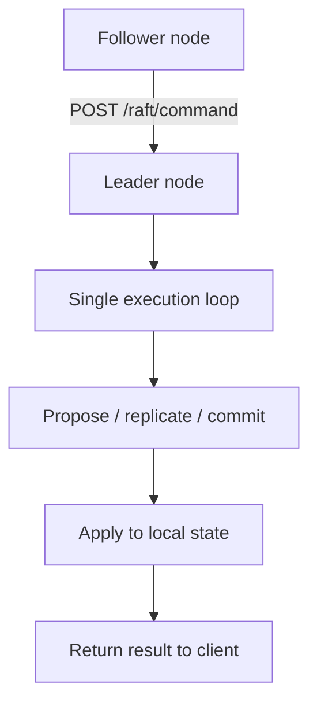
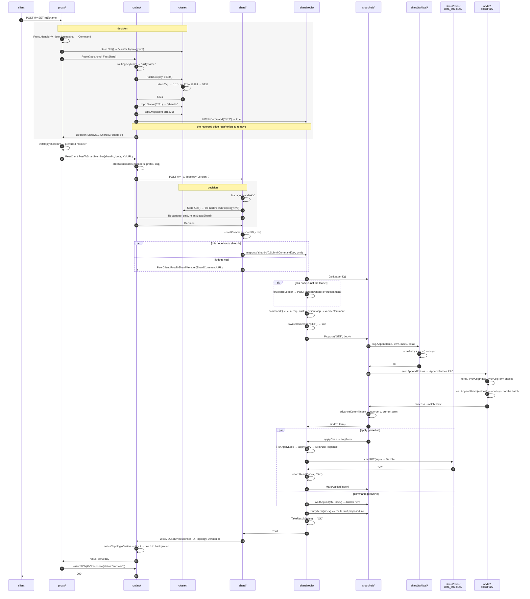
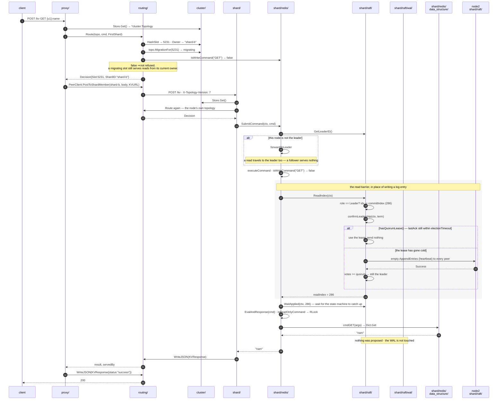

# Distributed key-value store

A distributed key-value store built from scratch in Go, using the **Raft consensus algorithm** for replication and fault tolerance. No external Raft libraries — the full leader election, log replication, and cluster membership protocol is implemented by hand.

# How to start

```bash
docker compose -f docker-compose.multiraft.yml up -d
```

Access UI
```
http://localhost:6600/dashboard/
```


## Architecture



### Endpoint flow

```text
Clients
  │
  ▼
HTTP handlers
  │
  ▼
Command queue
  │
  ▼
Single execution loop
  │
  ├─ Raft proposal / commit
  └─ Local store update
        │
        ▼
   Raft peers / WAL
```





### Follower-to-leader forwarding



## Sharding (multi-Raft)

One Raft group means one leader serializing every write. Sharding splits the
keyspace across several independent groups, so each group elects, replicates
and commits on its own.

```text
                       POST /kv  {"cmd":"SET","args":{"key":"user:7",...}}
                                        │
                              slot = crc32(key) % 16384
                                        │
                        topology: slot -> shard -> member nodes
                    ┌───────────────────┴───────────────────┐
              shard-0 (Raft group)                    shard-1 (Raft group)
        node1(L)   node2(F)   node3(F)          node4(F)  node5(F)  node6(L)
```

- **Slots** — a key hashes to one of `SLOTS` slots (16384 by default). Slots are
  the unit of ownership, so rebalancing never rehashes individual keys. A key
  may carry a hash tag — `{user:42}:profile` and `{user:42}:sessions` hash only
  the tag, so related keys share a slot and therefore a group.
- **Shards** — each shard is a full Raft group with its own WAL, state file,
  elections and state machine. A node hosts one group per shard it replicates,
  all behind a single HTTP listener under `/shards/<shard-id>/…`.
- **Topology** — a version-stamped map of `slot -> shard` and `shard -> members`,
  persisted per node and pushed to every node when it changes.
- **Rebalancing** — a consistent hash ring with virtual nodes and a bounded load
  cap assigns slots to shards, so adding or removing a shard moves close to its
  fair share of slots and leaves the rest untouched.

### The routed API

`POST /kv` is the one endpoint a client needs. It hashes the command's key,
finds the shard that owns the slot, and runs the command there — locally if this
node hosts the shard, over HTTP if it does not.

```bash
curl -sX POST localhost:5001/kv \
  -d '{"cmd":"SET","args":{"key":"user:7","value":"alice"}}'
# {"node_id":"node1","shard":"shard-0","slot":9279,"command":"SET",
#  "status":"success","result":"OK","topology_version":1,"served_by":"node1"}

# any node answers for any key
curl -sX POST localhost:5004/kv -d '{"cmd":"GET","args":{"key":"user:7"}}'

# ?redirect=1 returns the owning shard instead of proxying, for a client
# that wants to cache the slot map itself (Redis Cluster's MOVED)
curl -sX POST 'localhost:5001/kv?redirect=1' -d '{"cmd":"GET","args":{"key":"user:7"}}'
```

### Rebalancing the hash ring

```bash
# where would a key go, and what does the map look like now
curl -s 'localhost:5001/cluster/locate?key=user:7'
curl -s localhost:5001/cluster/shards

# preview: what would adding a shard move?
curl -sX POST 'localhost:5001/cluster/rebalance?dry_run=1' \
  -d '{"shards":[ ...full desired shard set... ]}'

# add a shard and migrate its slots to it
curl -sX POST localhost:5001/cluster/shards -d '{
  "action":"add","shard":"shard-2",
  "members":{"node1":"http://node1:5000","node4":"http://node4:5000","node6":"http://node6:5000"}
}'

# drain and remove one
curl -sX POST localhost:5001/cluster/shards -d '{"action":"remove","shard":"shard-2"}'
```

### Routing tier as its own service (`proxy` command)

Every node already routes: `POST /kv` on any node hashes the key and forwards to
whichever shard owns it. The `proxy` command runs only that part, as a separate
process that hosts no shard, runs no Raft group and stores nothing.

```bash
docker compose -f docker-compose.multiraft.yml up --build
curl -sX POST localhost:6200/kv -d '{"cmd":"SET","args":{"key":"user:1","value":"a"}}'
curl -sX POST localhost:6200/kv -d '{"cmd":"GET","args":{"key":"user:1"}}'
curl -s  localhost:6200/cluster/locate?key=user:1   # slot, owning shard, first hop

# standalone, outside Docker
SEEDS=http://localhost:5001,http://localhost:5004 PORT=6200 go run . proxy
```


### A write



Three things the package view shows that the role view does not:

- **`routing/` plays two parts.** Steps 4–12 it is the *decision rule*, calling
  down into `cluster/`. Steps 14–16 it is the *transport*, going over the network.
  One folder, two jobs that have nothing to do with each other.
- **The `par` block is the piece that reads wrong in the source.** `RunApplyLoop`
  runs in its own goroutine; `executeCommand` only waits. `MarkApplied` on the
  left branch is what releases `WaitApplied` on the right.
- **`cluster/` stops appearing after step 19.** Once the shard is known the map has
  no further part to play; everything after is consensus.

### A read


